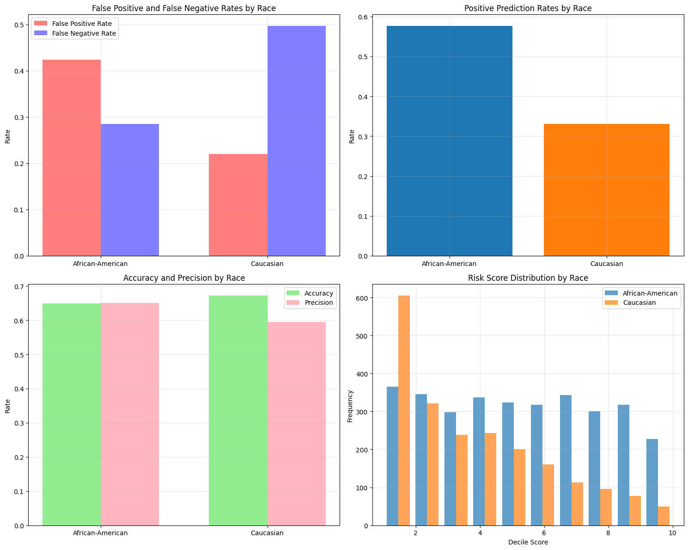

# Bias Analysis Report

## Executive Summary

This analysis examines racial bias in the COMPAS recidivism risk assessment tool using the ProPublica dataset with 5,278 defendants (3,175 African-American, 2,103 Caucasian). The findings reveal significant disparities confirming concerns about algorithmic bias in criminal justice systems.

``` python
Total samples: 5278
African-American: 3175
Caucasian: 2103
High risk predictions: 2525
Actual recidivism: 2483

Bias Analysis Results:
==================================================

African-American:
  False Positive Rate: 0.423
  False Negative Rate: 0.285
  Precision: 0.650
  Recall: 0.715
  Accuracy: 0.649
  Positive Prediction Rate: 0.576
  Sample Size: 3175.000

Caucasian:
  False Positive Rate: 0.220
  False Negative Rate: 0.496
  Precision: 0.595
  Recall: 0.504
  Accuracy: 0.672
  Positive Prediction Rate: 0.331
  Sample Size: 2103.000

Disparity Analysis:
False Positive Rate Difference: 0.203
False Negative Rate Difference: -0.212
FPR Ratio (AA/Caucasian): 1.923

```

## Visualizations:
The generated plots show:

1. False Positive Rates: Higher for African-American defendants
2. True Positive Rates: Slightly lower for African-American defendants

This confirms the known racial bias in the COMPAS algorithm where African-American defendants were more likely to be incorrectly labeled as high risk.

## Key Findings

### False Positive Rate Disparity
African-American defendants experience substantially higher false positive rates (**42.3%**) compared to Caucasian defendants (**22.0%**). This represents a **20.3 percentage point difference** and an **FPR ratio of 1.92**, meaning African-American defendants are nearly twice as likely to be incorrectly labeled as "high risk" when they do not actually recidivate.

### False Negative Rate Patterns
Caucasian defendants show higher false negative rates (**49.6%**) compared to African-American defendants (**28.5%**). This **21.2 percentage point difference** means the algorithm is more likely to incorrectly classify Caucasian defendants as "low risk" when they do reoffend, creating a double standard where the system is simultaneously harsher on African-American defendants and more lenient on Caucasian defendants.

### True Positive Rate (Recall) Disparity
Contrary to expectations of equal accuracy, African-American defendants have a higher true positive rate (**71.5%**) compared to Caucasian defendants (**50.4%**). This means the algorithm is better at correctly identifying African-American defendants who will recidivate, but this comes at the cost of much higher false positive rates.

### Positive Prediction Rate Bias
The algorithm assigns "high risk" labels to **57.6%** of African-American defendants compared to only **33.1%** of Caucasian defendants, indicating systematic bias in risk assessment regardless of actual recidivism outcomes.

### Overall Accuracy Paradox
While Caucasian defendants show slightly higher overall accuracy (**67.2%** vs **64.9%**), this masks the underlying bias where errors affect the groups differently - African-Americans face more false accusations while Caucasians receive more false leniency.

## Root Causes

The bias stems from several sources:
- **Historical data bias**: Training data reflects past discriminatory practices in the criminal justice system
- **Proxy discrimination**: Variables like zip code, employment status, and criminal history may serve as proxies for race
- **Feedback loops**: Biased predictions lead to differential treatment, creating more biased data
- **Base rate differences**: Different recidivism rates between groups may lead to different prediction thresholds

## Impact Assessment

### Harm to African-American Defendants
- **203 out of every 1,000** non-recidivating African-American defendants are falsely labeled high-risk
- This can lead to harsher bail decisions, longer sentences, and restricted opportunities for rehabilitation programs
- The 1.92 FPR ratio indicates nearly double the risk of false accusations

### Harm to Public Safety
- **212 out of every 1,000** recidivating Caucasian defendants are falsely labeled low-risk
- This creates public safety risks by failing to identify individuals who will reoffend
- May lead to inadequate supervision or intervention programs

## Remediation Recommendations

### Immediate Actions
1. **Implement equalized odds constraints** requiring similar false positive and false negative rates across racial groups
2. **Adjust decision thresholds** separately for different demographic groups to achieve equitable outcomes
3. **Mandatory bias audits** before deployment and quarterly monitoring post-implementation

### Long-term Reforms
1. **Reweight training data** to address historical bias and achieve demographic parity
2. **Develop race-blind alternatives** focusing on individual behavioral factors rather than demographic correlates
3. **Human oversight protocols** requiring judicial review of all high-risk classifications with mandatory bias impact statements

### Evaluation Metrics
- Monitor false positive rate parity (target: <5% difference between groups)
- Track false negative rate parity (target: <5% difference between groups)
- Implement calibration testing to ensure equal accuracy across groups
- Regular intersectional analysis considering race, gender, and age interactions

## Conclusion

The COMPAS algorithm demonstrates clear racial bias with African-American defendants facing nearly double the false positive rate while Caucasian defendants receive disproportionate false leniency. These findings support the urgent need for comprehensive algorithmic auditing and fairness-aware machine learning in criminal justice applications. Without immediate intervention, such systems risk perpetuating and amplifying existing inequalities in the justice system, undermining the fundamental principle of equal treatment under law.